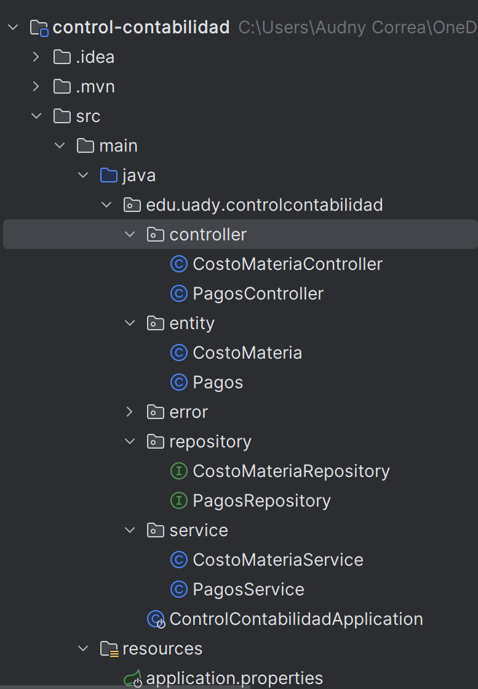
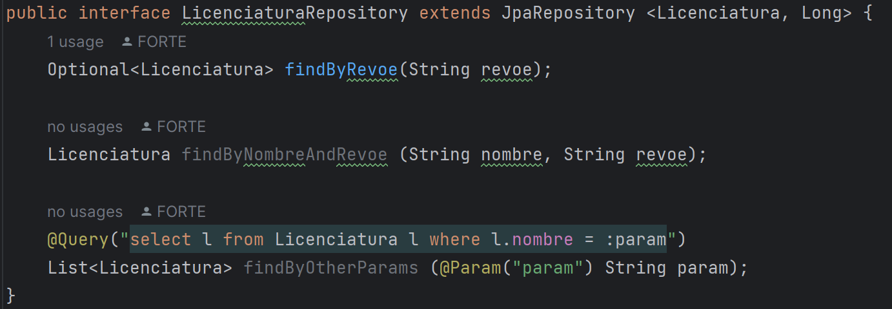

# Module 1: Good Practices ✅

## Object Oriented Programming Concepts

- Encapsulation
- Abstraction
- Inheritance
- Polymorphism

## SOLID Principles

- **S**ingle Responsability Principle

  > **_A class or function should only one reason to change._**

  This principle is applicable for any arterfact (a package, a component, etc.), not only a class. It establishes that a class should only have one responsability and not handle functionality that doesn't correspond to that class.

  This enasure high cohesion, low coupling and enhanced reusability.

  One example of this is the structure of the project we're working with. We use a layerd structure where we divide our application in different packages:

  - Controller
  - Service
  - Repository
  - Entity

  
  Each package have their own responsability in the application and allows us to have a better and cleaner organization of our project.

  The Controller is in charge of all the functionality with the direct interaction with the users. Inside this package are all the classes that have this role.

  The Service layer is in charge of all the business logic of the application. Inside this package are all the classes that have this role.

  The Repository layer is the one who communicates and does all the operations on the database. Inside this package are all the classes that have this role.

  The Entity layer is in charge of the modelling of tables of the database. Inside this package are all the classes that have this role.

- **O**pen-Closed Principle

  > **_A software artefact should be open for extension but clossed for modification._**

  This principle is established so we can prevent we modify our code and causing new bugs. The only exception for the modification is for fixing the existing bugs. For this example the most common example is the use of inheritance.

  In OOP we use inheritance to create higher level classes which we can extend in subclasses to model an specific behaviour.

  In our current project we do something similar with the use of the interface `JpaRepository` in our `LicenciaturaRepository.java`. This interface already has several methods implemented like: `save()`, `findAll()`, `saveAll()`, etc. So that we don't need to write or modify that code but we might need to find a specific field like the revoe we can implement it without touching the methods already implemented.
  

- **L**iskov Substitution Principle

  > **_Design your classes so that the client dependencies can be substituted with subclasses without the client knowing about the change._**

- **I**nterface Segregation Principle

  > **_Prevent classes on relying on things that they don't need._**

  This principle prevent us of creating large intefaces and spliting then into smaller ones. In our project we have the package Repository, instead of creating a hudge repository class that will handle all the entities of the application we can create different repository classes where each one will handle their corresponding entity. So instead of implementing this:

      public interface CoaApiRepository extends JpaRepository<Object, Long>{
        Licenciatura findLicenciaturaByRevoe(String revoe);

        List<PlanEstudio> findPlanEstudioByLicenciatura_Id(Long licenciaturaId);
      }

  Implement this:

      public interface LicenciaturaRepository extends JpaRepository<Licenciatura, Long>{
        Optional<Licenciatura> findByRevoe(String revoe);
      }

  And:

      public interface PlanEstudioRepository extends JpaRepository<PlanEstudio, Long>{
        List<PlanEstudio> findPlanEstudioByLicenciatura_Id(Long licenciaturaId);
      }

- **D**ependency Inversion Principle

  > **_Abstractions should not depend on details. Details should depend on abstractions._**

  This principle refers to decouple a class from another concrete class and use interfaces instead. When we directly instantiate a class we are directly coupling two classes and generating a dependency and if we want to switch to another dependency we need to change a lot of code.

  To prenvent this, Spring Boot uses the `@Autowired` annotation. This allows us to do automatic dependency injection so that the class can receive the references that they need to work.

  For example, we in the class `PagosController.java` we need to use the class `PagosService.java` so the controller can give the user a response. Instead of doing this:

      public class PagosController(){
        @GetMapping("/pagos")
        public ResponseEntity<?> getAllPagos(){
          PagosService pagosService = new PagosService();
          try {
            return ResponseEntity.ok().body(pagosService.findAllPagos());
          } catch (ControlContabilidadException e){
            return new ResponseEntity<>("Datos no encontrados", HttpStatus.OK);
          } catch (Exception exception){
            throw new RuntimeException(exception);
          }
        }
        ...
      }

  Use this:

      public class PagosController(){
        @Autowired
        private PagosService pagosService;

        @GetMapping("/pagos")
        public ResponseEntity<?> getAllPagos(){
          try {
            return ResponseEntity.ok().body(pagosService.findAllPagos());
          } catch (ControlContabilidadException e){
            return new ResponseEntity<>("Datos no encontrados", HttpStatus.OK);
          } catch (Exception exception){
            throw new RuntimeException(exception);
          }
        }
        ...
      }

[Index](README.md) | [Next](databases.md)
